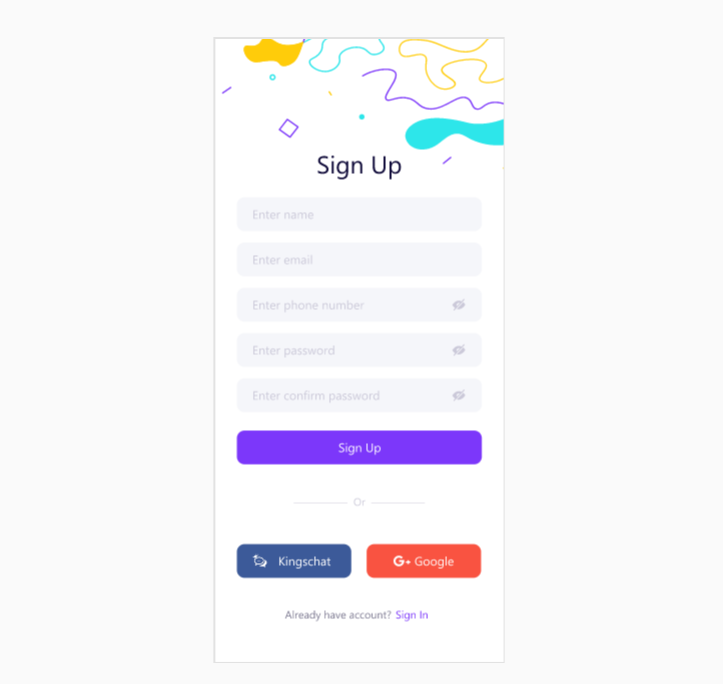
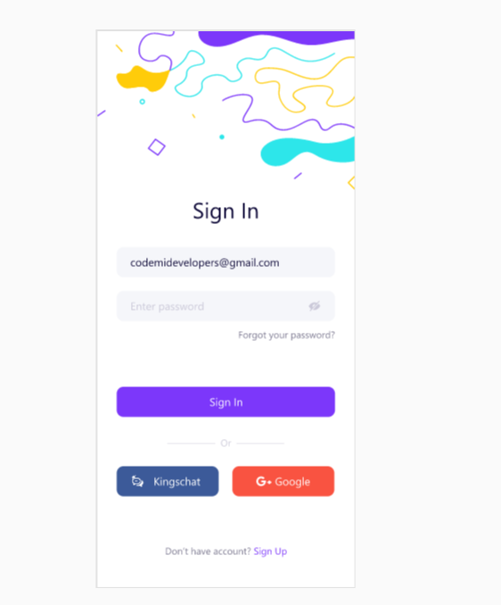
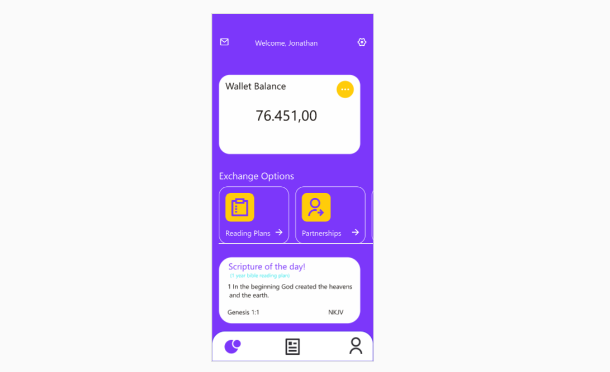
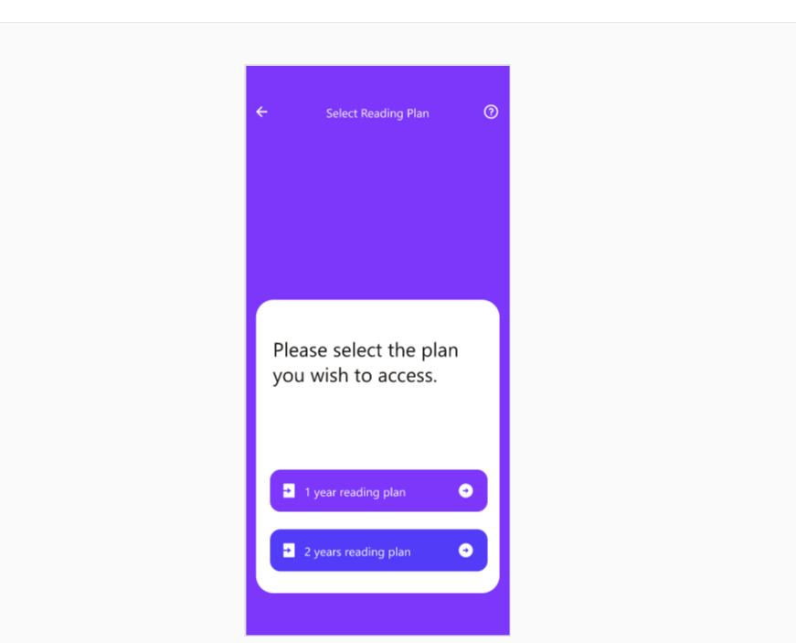
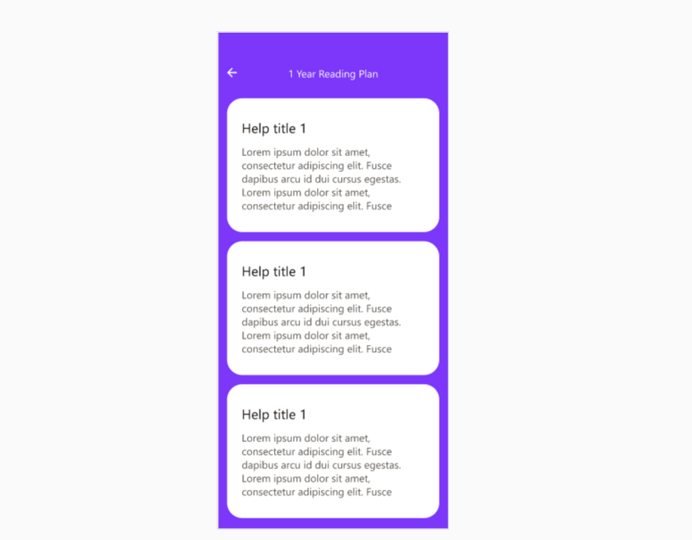

# MOLO APP

Welcome to molo app, before we get right into it, this documentation was written in various sections to allow you navigate the intergal parts of the application, see   [_Sections_](#Section)

## Sections

- [MOLO APP](#molo-app)
  - [Sections](#sections)
  - [Introduction](#introduction)
  - [How to use the app](#how-to-use-the-app)
  - [Sources and API's](#sources-and-apis)
  - [Contact us](#contact-us)
  
## Introduction

Molo app is a management application that was developed using REACT-native a cross platform framework that is used to build IOS and android apps alike. The app manages all partners in an automated manner such that users get notifications reminding them on their targeted giving schedule i.e _yearly_, _monthly_ _and_ _or_ _quaterly_. It also sends acknowledgements whenever donations are made or there is a partners birthday. There are various features of the app which includes:

1. **The management system**: The Fintech system will manage the users Partnership on their chosen arms. They will be able to fund their wallet balance, set a fixed amount to be deducted from their wallet recurrently (if enabled), Set personal giving targets based on time frames(Monthly, Quarterly or Yearly on any selected partnership arm) give offerings in Church, utility bills ( Airtime recharge, PCDL Subscription, CableTV subscription), send and receive money into their wallet.
2. **Raphsody Bible Reading Plan** : Users will get daily scriptural quotes, Choose a Bible Reading Plan and get daily reminders.
3. **Admin Dashboard**: This would report Apps activities to the Admin in figures ( Mathematical calculations), Data Analysis (Charts & Graphs), Reports of Zones, Churches and Groups Partnership performance to the Admin (each user will have to be registered under a zone, church etc).
4. **Intrusion detection system ( Cyber security)**: Data Analysis Include but not limited to Big data, Ai/ML, Aut Relational / Disturbe storage
Data Lake => Data Warehouse.

## How to use the app

Navigate to the sign in and simple follow the various forms as shown below




After you've signed up you should be directed to the sign in part which is:




simply fill in the data which you generated during the sign up, this will take you to the user dashboard.



The user dashboard has your wallet balance, reading plan, partnership, the user profile etc. The reading plan is a feature that is uncommon and looks like this:





>## Requirements

 - Andriod version 10.0.0 
 - iOS 14


## Sources and API's

```json
To fund Wallet:
================
  PUT/OPTION :yourhost/molonet/api/v1/Wallet

dataToSend: 
{

"action":"fund",
    
"email":"dids@gmail.com",
  
"amount":"200",
    
"ref":"66565TDF56543"

}


To GET WALLET BALANCE
=====================
  PUT/POST/GET :yourhost/molonet/api/v1/Wallet

DataToSEND:
{

"action":"bal",
"email":"dids@gmail.com"

}

==========================
NB:
`action` can be:
  fund     (to fund wallet)
  bal      (Retrive wallet Balance)
  transfer:(Tranfsfer fund to molo user)
==========================


==================================
for Airtime Topup and DATA TOP UP:
network = [airtel,9mobile,mtn,glo] 
==================================
 PUT/OPTION: yourhost/molonet/api/v1/Topup

AIRTIME RECHARGE:
{
  
"phone":"08139240318",
    
"amount":50,
    
"txType":"AIRTIME_VTU",
    
"network":"mtn"

}

DATA RECHARGE
{
  
"phone":"08139240318",
    
"amount":50,
    
"txType":"DATA_VTU",
    
"network":"mtn"

}


NB: Please test only with NGN50


SUMMARY OF APIs
==============
TopUpAPI        = "api/v1/Topup/index.php";
FundWalletAPI   = "api/v1/Wallet/index.php";
-----------------------------------------------
DataPlanAPI     = "api/v1/Dataplans/index.php";

send GET REQUEST to yourhost/molonet/api/v1/Dataplans?network=9mobile
to see list of data plans for chosen network 


Please follow the following sequentially to test:
1. Signup here "yourhost/api/v1/Auth/Register.php"
2. You can Login "yourhost/api/v1/Auth/Login.php" (optional)
3. Fund Wallet  "yourhost/molonet/api/v1/Wallet"
4. Check Wallet Balance "yourhost/molonet/api/v1/Wallet"
5. Topup your registered phone yourhost/molonet/api/v1/Topup
6. TopUp Data  yourhost/molonet/api/v1/Topup
7. List data Plans for specific network service provider
    "/molonet/api/v1/Dataplans?network=9mobile"
```

>All APIs are available here : https://github.com/NnaDid/moloApi

## Contact us
- [Twitter]()
- [github]()
- [Email]()
